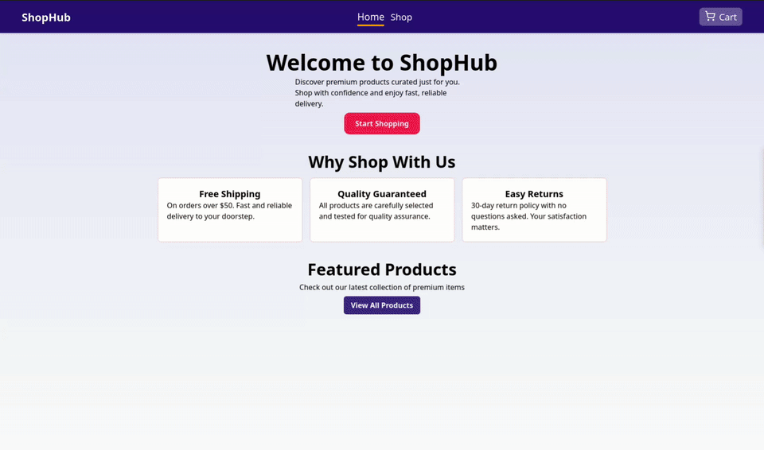
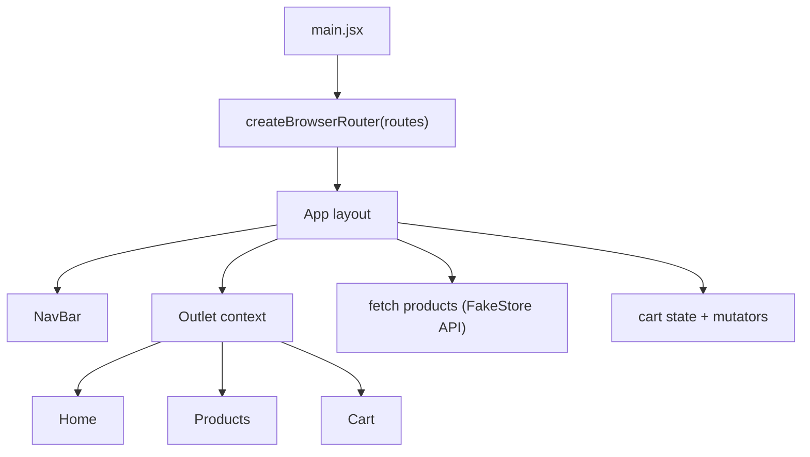
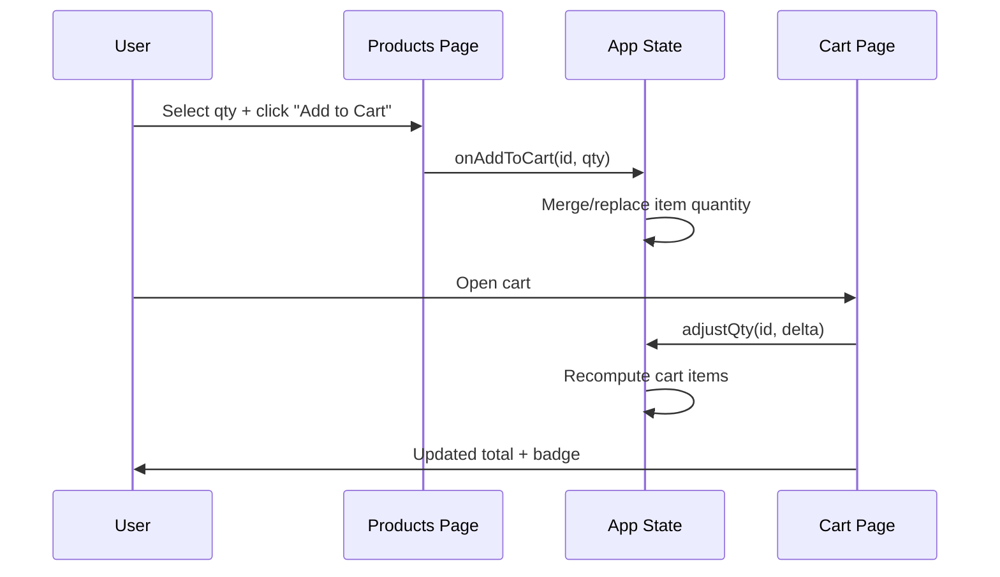

# Odin Shopping Cart

A React + Vite shopping cart project built for The Odin Project curriculum, focused on nested routing, shared state via `Outlet` context, async data fetching, and practical UI composition with Tailwind + MUI.

[Live Demo](https://dazzling-daifuku-85bba4.netlify.app/)

---

## Preview



---

## Project Goals

- Practice client-side routing with nested layouts and child routes.
- Fetch external product data and render dynamic UI states.
- Implement full cart behavior (add item, update quantity, remove item, checkout flow).
- Build a clean, responsive, component-based frontend.

---

## Features

- **Routing with shared layout**
  - `Home`, `Products`, and `Cart` pages are nested under a common `App` layout.
  - Shared app state is passed to children through React Router `Outlet` context.

- **Asynchronous product loading**
  - Products are fetched from FakeStore API.
  - Includes loading and error states for safer UX.

- **Cart logic**
  - Add products with chosen quantity.
  - Increment/decrement quantity directly in cart.
  - Remove item instantly using the trash action.
  - Dynamic cart badge and order summary total.

- **UI stack**
  - Tailwind CSS for utility-first styling.
  - MUI `Modal` for checkout confirmation.
  - Lucide icons for lightweight iconography.

---

## Tech Stack

- `React 19`
- `React Router 7`
- `Vite`
- `Tailwind CSS 4`
- `MUI`
- `Lucide React`

---

## Architecture



### Data/State Flow



---

## Key Implementation Notes

- Shared state is centralized in `App`:
  - `products`, `loading`, `error`, and `cart`.
  - mutation handlers: `onAddToCart` and `adjustQty`.
- UI rendering in `Products` and `Cart` depends on outlet context instead of prop drilling through route wrappers.
- Totals in checkout are computed with a reduction over `cart`.

---

## What Was Learned

1. How nested routes improve app structure in medium-sized frontends.
2. How to share route-level state and handlers to multiple pages cleanly.
3. How async fetch state (`loading/error/success`) shapes rendering strategy.
4. How cart updates require immutable transforms (`map/filter/reduce`) for predictable UI refreshes.
5. How mixing utility CSS (Tailwind) with component libraries (MUI) can speed up delivery when used intentionally.

---

## Difficulties and How They Were Addressed

- **State synchronization across pages**
  - Challenge: keeping `Products`, `NavBar`, and `Cart` in sync after quantity changes.
  - Approach: centralize updates in `App` and pass handlers through context.

- **Cart quantity edge cases**
  - Challenge: avoid negative quantities and remove items when quantity reaches zero.
  - Approach: guard quantity updates and filter out zero-quantity items.

- **Async rendering lifecycle**
  - Challenge: prevent UI crashes before products are loaded.
  - Approach: explicit loading + error checks before mapping product cards.

---

## Optimization Notes

Current app-level optimizations:

- Cart operations rely on O(n) array transforms with immutable updates, which is simple and robust for project scale.
- Route-based decomposition keeps renders scoped by page concern.

Potential improvements for next iteration:

- Use stable identifiers from API data (`product.id`) end-to-end instead of array index mapping.
- Memoize frequently derived values (cart size/total) if product list grows.
- Add `React.memo` for product row/card components to reduce avoidable re-renders.
- Introduce local persistence (`localStorage`) for cart recovery between refreshes.
- Add tests for cart reducers/handlers and route-level rendering states.

---

## Academic Value

This project is strong practice for core frontend engineering concepts:

- **Applied data structures in UI:** arrays as an in-memory state model with transform pipelines.
- **State modeling:** balancing global/shared state vs component-local state.
- **Asynchronous programming:** fetch lifecycle and error boundaries in user interfaces.
- **Component architecture:** reusable component boundaries and composability.
- **Human-computer interaction:** feedback loops (badge counts, totals, modals) for user confidence.

The project is a good bridge from basic React syntax to real-world interface behavior where correctness and UX consistency matter.

---

## Getting Started

```bash
npm install
npm run dev
```

Build for production:

```bash
npm run build
npm run preview
```

---

## Project Structure

```text
.
├── docs/
│   ├── preview.webm
│   └── preview.gif
├── src/
│   ├── components/
│   │   ├── Cart.jsx
│   │   ├── Home.jsx
│   │   ├── NavBar.jsx
│   │   └── Products.jsx
│   ├── css/
│   │   └── index.css
│   ├── App.jsx
│   ├── ErrorPage.jsx
│   ├── main.jsx
│   └── routes.jsx
├── index.html
└── package.json
```

---

## Future Work

- Search, category filters, and sorting.
- Product details route with deep links.
- Better currency formatting and locale support.
- Unit + integration tests (Vitest/RTL).
- Accessibility pass (keyboard and screen-reader improvements).
